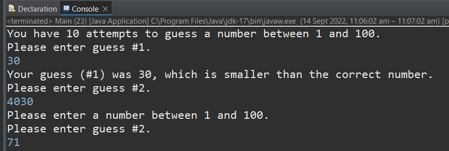

# Java Number Game

### A simple Java console game to guess a number between 1 and 100.

I made this as a personal project using Java on 14/09/2022.

## Design

The design was based on the Wordle project I completed during my time at \_nology. The program generates a random number between 1 and 100, and the user then enters their guess into the console (via a scanner). They receive feedback depending on whether:

-   their guess is outside parameters (e.g. less than 1 or greater than 100)
-   their guess is lower or higher than the random number
-   their guess is correct (at which point a congratulations is printed, and the program closes), or
-   they failed to guess the number inside 10 attempts (at which point the random number is revealed and the program is closed).

## Future Plans

I hope to create a front-end app for this project in Javascript, so that it's not just a console application. This will then be easier to use. I can then also implement some more functionality (e.g. the user potentially being able to change the range of numbers, e.g. from 1-1000 if they find the 1-100 game too easy.)
